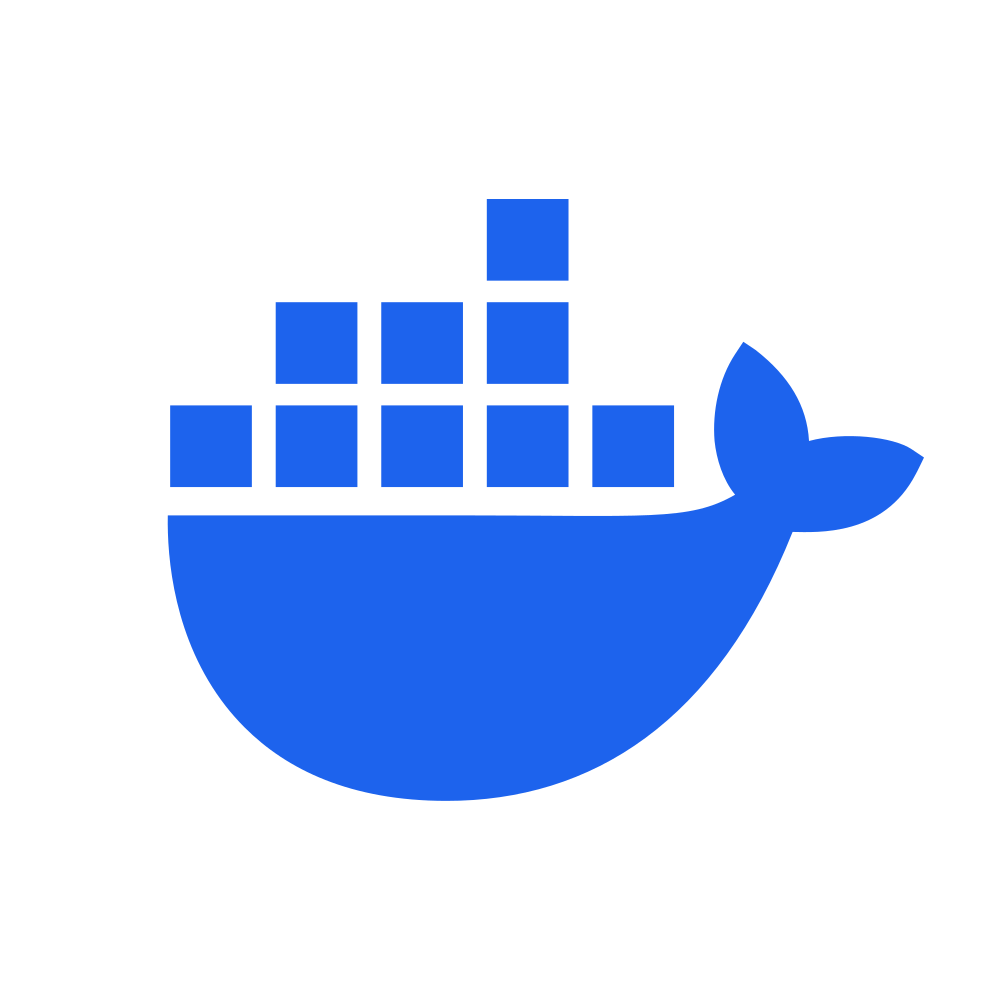

<h1 align="center">heya 👋🏼, it's calob </h1>
<h3 align="center">software enigneer out of indiana</h3>

## a little about me

- 🛠️ president of [bloominglabs](http://bloominglabs.org/index.php/Main_Page)
- 👨🏻‍💻 weekend homelab enthustist
- 🩸 always on the bleeding edge

## favorite tech

<table>
  <tr>
    <td align="center" width="96">
      
       docker
    </td>
    <td align="center" width="96">
      
       typescript
    </td>
    <td align="center" width="96">
      
       rust
    </td>
    <td align="center" width="96">
      
       nix
    </td>
    <td align="center" width="96">
      
       xcp-ng
    </td>
  </tr>
</table>

## current projects